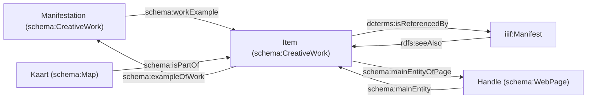
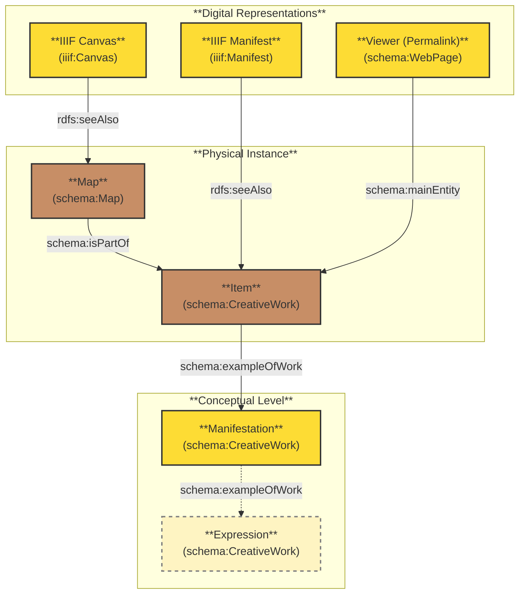

# Template

Voor ons template in `schema.org` moeten we rekening houden met twee vormen van onze data:

1. Samengestelde werken, waarvan we individuele bladen (=kaarten) beschrijven.
2. Losse kaartbladen. Hiervoor geldt dat de beschrijving van de kaart en de metadata uit het MARC-record eigenlijk samenvallen.

Toch kiezen we ervoor om beide vormen op dezelfde manier te beschrijven, ten behoeve van de consistentie van de data en daarmee de querybaarheid. Dit leidt bij losse kaartbladen wel tot een herhaling van data, maar we denken dat dit functioneel is, omdat de data over een individuele kaart een andere gebruikersgroep kan bedienen.

## Model



Alternatieve representatie:




## Overwegingen

- We hebben toch onderscheid gemaakt tussen Manifestation (of 'Staat' van een kaart), Item én visuele voorstelling op basis van de informatie die we voor een samengesteld werk (Atlas) hebben. Moeten we voor de consistentie dit niet ook doorvoeren voor de losse kaartbladen? Dan trekken we materiële drager en visuele voorstelling deels uit elkaar.
  - We modelleren dit uniform, ook al wringt dit wat bij losse bladen.
- Hoe maken we URIs voor de kaarten? Dit is sterk gerelateerd aan de URIs van de Canvassen in een Manifest.
  - We onderzoeken of de crowdsourcingsmodule van Goobi gebruikt kan worden om de data te bewerken. URIs kunnen toegekend worden als de data omgewerkt worden naar schema:Map voor in het LOD-endpoint. Mogelijk kan het Canvas-target (her)gebruikt worden in zo'n URI.
  - Bijvoorbeeld: `https://pid.uba.uva.nl/ark:/88238/b1990011183160205131/HB-KZL_XI_A_9-10/+canvas1+/+kaart1+`
- Schema kent een `schema:Atlas` en `schema:Map`, maar in de praktijk kunnen we geen onderscheid maken in de data. Het is ongewenst om losse kaartbladen ook 'Atlas' te noemen. We besluiten de volgende (generieke) typeringen te gebruiken. Via een `schema:additionalType` kunnen we het type nader specificeren, bijvoorbeeld vanuit het MARC-record. Dit is een punt voor dataverbetering.
  - Manifestation: `schema:CreativeWork`
  - Item: `schema:CreativeWork`
  - Kaart: `schema:Map`
- Met een `rdfs:seeAlso` kun je in een Manifest naar gestructureerde data linken (het hele ding dat gescand is). Als inverse hanteren we `dcterms:isReferencedBy`.
- Moet die `rdfs:seeAlso` ook op het Canvas gezet worden met een link naar alleen de gestructureerde data van de kaart? We kunnen dit ook via een Web Annotation doen (zie: https://iiif.io/api/content-state/0.2/#initialization-mechanisms-link)
  - De `rdfs:seeAlso` op een `iiif:Canvas` is een snelroute. We zoeken uit of dit kan in de tool die de Canvasdata maakt. En indien dit kan, zoeken we ook uit of het wenselijk is om ook hier een inverse (`dcterms:isReferencedBy`) voor te gebruiken.

## RDF (Turtle)

### Samengestelde werken

```turtle
@prefix rdf: <http://www.w3.org/1999/02/22-rdf-syntax-ns#> .
@prefix rdfs: <http://www.w3.org/2000/01/rdf-schema#> .
@prefix xsd: <http://www.w3.org/2001/XMLSchema#> .
@prefix schema: <https://schema.org/>.
@prefix dcterms: <http://purl.org/dc/terms/> .
@prefix iiif_prezi: <http://iiif.io/api/presentation/3#> .

# IFLA-LRM Manifestation
<https://pid.uba.uva.nl/ark:/88238/b1990011183160205131>
    a schema:CreativeWork ;
    schema:name "Atlas minor sive Totius orbis terrarum contracta  delinea[ta] ex conatibus Nic. Visscher." ;
    schema:alternateName "????" ; # TODO: invullen
    schema:sameAs  <https://www.worldcat.org/oclc/68851470> ;
    schema:publication [
        a schema:PublicationEvent ;
        schema:description "Amstelaedami :apud Nicolaum Visscher, [ca.1688?]" ;
        schema:startDate "1688"^^xsd:gYear ;
        schema:publishedBy <http://data.bibliotheken.nl/id/thes/p077130944>
        ] ;#deze levert een 404 ...
   schema:materialExtent "2 dln." ;
   schema:size "in-2" ;
   schema:description "Uitgeg. door Claes Jansz Visscher." ;
   schema:description "Typogr. titel van dl II: Atlas minor sive Geographia compendiosa, qua orbis terrarum, per paucas attamen novissimas tabulas ostenditur." ;
   schema:description "Met gegrav. titel (dl I), 88 + 90 krtn." ;
   schema:workExample <https://pid.uba.uva.nl/ark:/88238/b1990011183160205131/HB-KZL_XI_A_9-10> .

# IFLA-LRM Item
<https://pid.uba.uva.nl/ark:/88238/b1990011183160205131/HB-KZL_XI_A_9-10>
    a schema:CreativeWork ;
    schema:name "Atlas minor sive Totius orbis terrarum contracta  delinea[ta] ex conatibus Nic. Visscher." ;
    schema:exampleOfWork <https://pid.uba.uva.nl/ark:/88238/b1990011183160205131> ;
    schema:description "In twee perkamenten banden, waarbij op voor- en achterplat in goud gestempeld: Oude-Syts Huys Zitten Armen Anno 1689" ;
    schema:description "De 178 kaarten in contemporaine handkleuring" ;
    schema:mainEntityOfPage <https://hdl.handle.net/11245/3.20867> ;
    dcterms:isReferencedBy <https://pid.uba.uva.nl/ark:/88238/b1990011183160205131/HB-KZL_XI_A_9-10/manifest> .

# Digitale representatie van het Item (?) als IIIF:Manifest
<https://pid.uba.uva.nl/ark:/88238/b1990011183160205131/HB-KZL_XI_A_9-10/manifest>
    a iiif_prezi:Manifest ;
    rdfs:label "Atlas minor sive Totius orbis terrarum contracta delinea[ta] ex conatibus Nic. Visscher" ;
    rdfs:seeAlso <https://pid.uba.uva.nl/ark:/88238/b1990011183160205131/HB-KZL_XI_A_9-10> .

# Webpagina/Handle over het Item
<https://hdl.handle.net/11245/3.20867>
    a schema:WebPage ;
    schema:mainEntity <https://pid.uba.uva.nl/ark:/88238/b1990011183160205131/HB-KZL_XI_A_9-10> .

# Kaart
<https://pid.uba.uva.nl/ark:/88238/b1990011183160205131/HB-KZL_XI_A_9-10/+canvas1+/+kaart1+>
    a schema:Map ;
    schema:isPartOf <https://pid.uba.uva.nl/ark:/88238/b1990011183160205131/HB-KZL_XI_A_9-10> ;
    schema:name "Indiae" . # TODO: Welke extra gegevens moeten hier nog bij over de individuele kaart? Kijken naar informatie voor de individuele kaartbladen.

```

### Losse kaartbladen

```turtle
@prefix rdf: <http://www.w3.org/1999/02/22-rdf-syntax-ns#> .
@prefix rdfs: <http://www.w3.org/2000/01/rdf-schema#> .
@prefix xsd: <http://www.w3.org/2001/XMLSchema#> .
@prefix schema: <https://schema.org/>.
@prefix dcterms: <http://purl.org/dc/terms/> .
@prefix iiif_prezi: <http://iiif.io/api/presentation/3#> .

# IFLA-LRM Manifestation
<https://pid.uba.uva.nl/ark:/88238/b19941413329105131>
    a schema:CreativeWork ;
    schema:name "Amsterdam" ;
    schema:alternateName "????" ;
    schema:sameAs <https://www.worldcat.org/oclc/1382783629> ;
    schema:publication [
        a schema:PublicationEvent ;
        schema:description "Amsterdam : Seyffardt's Boekhandel, 1918." ;
        schema:startDate "1918"^^xsd:gYear ;
        schema:publishedBy <http://id.loc.gov/authorities/names/no2008060786>
    ] ;
    schema:about <http://id.worldcat.org/fast/1204180> ;
    schema:materialExtent "1 map" ;
    schema:description "Panel title: Plattegrond der stad Amsterdam, met de tramlijnen, benevens opgave waar de grachten en straten op de kaart te vinden zijn : gids voor vreemdelingen." ;
    schema:description "Verso: Tourist infromation in Dutch, French and English and publisher's advertisement." ;
    schema:description "Map surrounded by index." ;
    schema:description "Scale 1:13,750." ; # TODO: andere property vinden. De schaal staat ook gecodeerd in het record
    schema:size  "36 x 35.56 cm on sheet 50 x 55.5 cm";
    schema:workExample <https://pid.uba.uva.nl/ark:/88238/b19941413329105131/HB-KZL_101.09.11> .

# IFLA-LRM Item
<https://pid.uba.uva.nl/ark:/88238/b19941413329105131/HB-KZL_101.09.11>
    a schema:CreativeWork ;
    schema:name "Amsterdam";
    schema:exampleOfWork <https://pid.uba.uva.nl/ark:/88238/b19941413329105131> ;
    schema:mainEntityOfPage <https://hdl.handle.net/11245/3.40073> ;
    dcterms:isReferencedBy <https://pid.uba.uva.nl/ark:/88238/b19941413329105131/HB-KZL_101.09.11/manifest> .

# Digitale representatie van het Item (?) als IIIF:Manifest
<https://pid.uba.uva.nl/ark:/88238/b19941413329105131/HB-KZL_101.09.11/manifest>
    a iiif_prezi:Manifest ;
    rdfs:label "Amsterdam" ;
    rdfs:seeAlso <https://pid.uba.uva.nl/ark:/88238/b19941413329105131/HB-KZL_101.09.11> .

# Webpagina/Handle over het Item
<https://hdl.handle.net/11245/3.40073>
    a schema:WebPage ;
    schema:mainEntity <https://pid.uba.uva.nl/ark:/88238/b19941413329105131/HB-KZL_101.09.11> .

# Kaart
<https://pid.uba.uva.nl/ark:/88238/b19941413329105131/HB-KZL_101.09.11/+canvas1+/+kaart1+>
    a schema:Map ;
    schema:isPartOf <https://pid.uba.uva.nl/ark:/88238/b19941413329105131/HB-KZL_101.09.11> ;
    schema:name "Amsterdam" . # TODO: Welke extra gegevens moeten hier nog bij over de individuele kaart? Hier kan dit gekopieerd worden uit de informatie hierboven.
```
